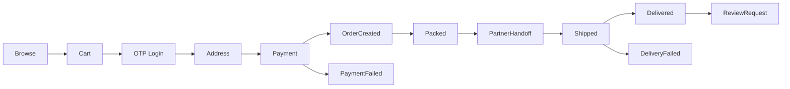

# 06 - Business Flows

Status: Draft for approval

## Order Flow

## Payment Flow

1. Customer confirms cart.
2. Backend creates payment order with Razorpay.
3. Customer pays using online payment/UPI.
4. Razorpay redirects/callbacks.
5. Backend verifies payment.
6. Webhook confirms status idempotently.
7. Order/payment state is updated.

## Delivery Partner Flow

1. BrahmiBhojan packs order internally.
2. Admin assigns/hands order to partner such as Delhivery.
3. Tracking reference is captured if available.
4. Status is updated manually or through integration later.
5. Customer receives notifications.

## Return Eligibility Flow

1. Admin marks product/category returnable or non-returnable.
2. Customer can request return only for eligible items.
3. Admin reviews request.
4. Refund/replacement decision follows policy.

## GST Flow

GST is applied at cart level during checkout. The system must store cart/order tax summary and preserve purchase-time values in the order snapshot.

