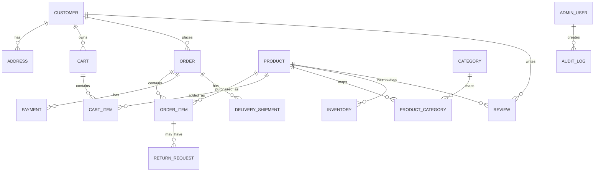

# 11 - ER Diagrams

Status: Draft for approval

## High-Level ERD

## Notes

Detailed columns, keys, indexes, and constraints will be finalized during implementation planning after database design approval.

