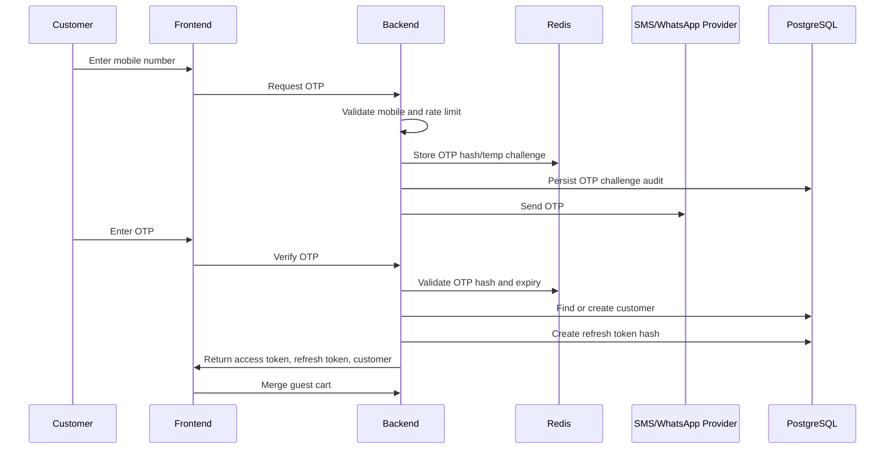

# 13 - Authentication Design

Status: Refined draft for approval  
Project: BrahmiBhojan  
Last Updated: 2026-07-06

## 1. Purpose

This document defines customer authentication for BrahmiBhojan. The platform uses mobile OTP only. Password login and social login are excluded by product decision.

## 2. Authentication Decisions

| Topic | Decision |
| --- | --- |
| Customer identity | Mobile number |
| Signup | Automatic after OTP verification |
| Passwords | Not supported |
| Social login | Not supported |
| Email | Optional profile field only |
| Session | JWT access token plus refresh token |
| OTP storage | Hashed OTP only |

## 3. OTP Login Flow

## 4. OTP Rules

| Rule | Requirement |
| --- | --- |
| Expiry | OTP should expire quickly, recommended 5 minutes. |
| Length | 6 digits recommended. |
| Storage | Store hash, not raw OTP. |
| Attempts | Limit verification attempts per challenge. |
| Request rate | Limit OTP requests by mobile number, IP, and device/browser where practical. |
| Resend | Allow resend after cooldown. |
| Provider fallback | Support SMS first and WhatsApp as fallback or future option. |

## 5. Token Rules

| Token | Purpose | Storage |
| --- | --- | --- |
| Access token | Short-lived API authentication. | Frontend runtime/http-only cookie decision in frontend/security design. |
| Refresh token | Obtain new access token. | Hash stored in DB; raw token only sent to client. |

Recommended lifetimes:

- Access token: 15 minutes.
- Refresh token: 30 days.

Refresh token rotation is recommended. Logout revokes the active refresh token.

## 6. Account Creation

If OTP verification succeeds and no customer exists for the mobile number:

1. Create customer.
2. Set `mobile_verified_at`.
3. Set status `ACTIVE`.
4. Issue tokens.
5. Trigger welcome notification if enabled.

Name, email, and address are collected later.

## 7. Guest Cart Merge

Authentication does not directly merge cart inside token issuance. After successful login, the frontend calls cart merge or the backend triggers a merge using the guest cart token. The merge must be transactional.

## 8. Admin Authentication

Initial admin authentication can be implemented separately from customer OTP. Admin users should not use social login. Final admin login method must be confirmed before implementation.

Recommendation requiring confirmation: use email/mobile plus password or admin OTP for admin portal? Customer passwords remain prohibited either way.

## 9. Security Controls

- Do not log OTP values.
- Do not log access or refresh tokens.
- Mask mobile numbers in logs.
- Rate-limit OTP endpoints.
- Block suspicious repeated attempts.
- Verify refresh token hash on rotation.
- Revoke refresh tokens on logout.
- Use HTTPS in production.

## 10. Acceptance Criteria

- Customer can log in with mobile OTP only.
- New customer is auto-created after verified OTP.
- No password or social login endpoints exist.
- OTPs and refresh tokens are not stored raw.
- Guest cart merge is supported after login.

