# 16 - Checkout

Status: Refined draft for approval  
Project: BrahmiBhojan  
Last Updated: 2026-07-06

## 1. Purpose

This document defines the checkout flow, validations, payment initiation, order creation boundary, GST behavior, and failure handling.

## 2. Checkout Flow

```mermaid
flowchart LR
CartReview["Cart Review"] --> Login["OTP Login"]
Login --> Merge["Guest Cart Merge"]
Merge --> Address["Delivery Address"]
Address --> Validate["Checkout Validation"]
Validate --> PaymentIntent["Create Razorpay Payment"]
PaymentIntent --> Pay["Customer Pays Online/UPI"]
Pay --> Verify["Verify Payment"]
Verify --> Order["Create/Confirm Order"]
Order --> Confirmation["Order Confirmation"]
```

## 3. Mandatory Rules

- Checkout requires verified customer login.
- Complete address with pincode/locality is required.
- Cash on delivery is not supported.
- Razorpay online payment and UPI are supported.
- GST is calculated at cart level.
- Server recalculates all totals.
- Checkout-sensitive operations must be idempotent.

## 4. Checkout Validation

Validation must check:

- Customer is active.
- Cart is active and non-empty.
- Products are active and visible.
- Stock is sufficient.
- Prices/offers are current.
- Coupon is valid.
- GST can be calculated.
- Address is complete.
- Pincode/locality is serviceable.
- Return eligibility display is available for items.

## 5. Payment and Order Boundary

Recommended approach:

1. Validate checkout.
2. Create internal pending order or checkout session.
3. Create Razorpay payment order.
4. Customer pays.
5. Verify payment callback/webhook.
6. Mark payment success.
7. Move order to paid/packing state.

This prevents losing payment context if the customer closes the browser.

## 6. Idempotency

Use idempotency keys for:

- Checkout validation session where persisted.
- Payment intent creation.
- Order confirmation.

Repeated requests with the same key must return the existing result.

## 7. Failure Handling

| Failure | Behavior |
| --- | --- |
| Payment failed | Keep order/payment failed or pending; allow retry if policy allows. |
| Payment callback missed | Webhook updates payment later. |
| Webhook duplicate | Ignore after idempotency check. |
| Stock changed | Revalidate before payment intent; block if unavailable. |
| Address not serviceable | Block checkout with clear message. |
| Coupon expired | Remove coupon and recalculate total. |

## 8. Acceptance Criteria

- Guest cannot checkout.
- Customer sees final payable amount before payment.
- Duplicate clicks do not create duplicate orders/payments.
- Payment and order states remain recoverable after browser close.
- COD does not appear as an option.

