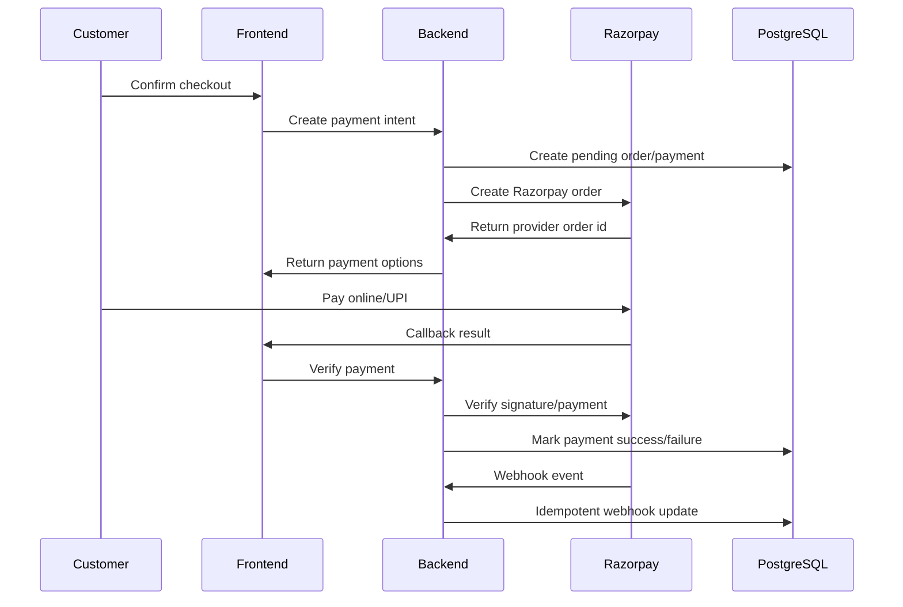

# 19 - Payments

Status: Refined draft for approval  
Project: BrahmiBhojan  
Last Updated: 2026-07-06

## 1. Purpose

This document defines payment behavior for BrahmiBhojan launch using Razorpay online payments and UPI. Cash on delivery is excluded.

## 2. Launch Payment Modes

| Mode | Status |
| --- | --- |
| UPI | Supported via Razorpay |
| Cards | Supported via Razorpay if enabled |
| Net banking | Supported via Razorpay if enabled |
| Wallets | Supported via Razorpay if enabled |
| Cash on delivery | Not supported |

## 3. Payment Flow

## 4. Payment Statuses

- CREATED
- PENDING
- SUCCESS
- FAILED
- REFUND_PENDING
- REFUNDED
- PARTIALLY_REFUNDED

## 5. Razorpay Requirements

- Create Razorpay order server-side.
- Never create payment amounts from client totals.
- Verify Razorpay signature.
- Process webhooks idempotently.
- Store provider order ID.
- Store provider payment ID when available.
- Store failure reason where available.
- Support refunds for approved cancellation/return cases.

## 6. Idempotency

Payment operations must protect against:

- Duplicate payment intent requests.
- Duplicate Razorpay callbacks.
- Duplicate webhooks.
- Retry after network failure.

Use provider event ID for webhook idempotency and internal idempotency key for checkout payment intent.

## 7. Refund Rules

Refunds can be initiated only for:

- Approved cancellation with successful payment.
- Approved return where refund applies.
- Admin-approved exception.

Refund actions must be audited.

## 8. Reconciliation

Admin/finance should be able to compare:

- Internal order amount.
- Internal payment status.
- Razorpay payment ID.
- Razorpay settlement/refund state.
- Failure/refund reasons.

## 9. Acceptance Criteria

- COD is not exposed.
- UPI/online payment is supported through Razorpay.
- Webhooks cannot create duplicate payment updates.
- Payment status is separate from order status.
- Refunds are linked to approved business workflows.

