# BrahmiBhojan Vision & Business Strategy

## Document Control

| Field | Value |
| --- | --- |
| Project | BrahmiBhojan |
| Document | 01 - Vision & Business Strategy |
| Status | Draft for approval |
| Owner | Product & Architecture |
| Audience | Founders, leadership, product, engineering, operations, marketing, finance, support |
| Last Updated | 2026-07-05 |

## 1. Executive Summary

BrahmiBhojan is an online grocery and healthy foods commerce platform focused on traditional, natural, and wellness-oriented food categories such as millets, rice, pulses, cold pressed oils, pickles, spices, dry fruits, herbal products, and future adjacent categories.

The platform must be designed as a reusable ecommerce engine, not as a one-off storefront. BrahmiBhojan is the first brand on this engine. Future brands, catalog structures, pricing models, regional assortments, marketing campaigns, and fulfillment models must be possible without a major redesign.

The strategic goal is to build a trustworthy, scalable, and operations-ready commerce platform that can start lean, serve customers reliably, and grow into a multi-brand digital commerce business.

## 2. Vision Statement

To become a trusted digital destination for healthy, traditional, and natural foods by combining authentic products, transparent commerce, reliable delivery, and a scalable technology platform that can support multiple brands and regions over time.

## 3. Mission Statement

BrahmiBhojan will make high-quality traditional and healthy food products easy to discover, purchase, reorder, and trust by offering a simple customer experience, mobile-first OTP authentication, reliable fulfillment, transparent pricing, and strong operational controls.

## 4. Strategic Objectives

### 4.1 Business Objectives

| Objective | Description | Why It Matters |
| --- | --- | --- |
| Build a trusted healthy grocery brand | Establish BrahmiBhojan as a credible source for natural and traditional food products. | Trust is a primary purchase driver for food, wellness, and household categories. |
| Enable online-first sales | Allow customers to browse, search, add to cart, and purchase products digitally. | Digital commerce expands reach beyond local retail and enables measurable growth. |
| Support repeat purchases | Make reordering, offers, and customer retention central to the model. | Grocery has high repeat potential; retention improves profitability. |
| Create a reusable commerce engine | Build platform capabilities that can support future brands. | Avoids rebuilding core ecommerce systems when the business expands. |
| Build operational visibility | Provide admin, analytics, inventory, order, payment, and marketing controls. | Ecommerce succeeds only when operations are measurable and manageable. |
| Enable geographic growth | Track and optimize performance by country, state, district, town, village, locality, and pincode. | Grocery demand, delivery performance, and marketing vary heavily by geography. |

### 4.2 Product Objectives

| Objective | Description | Why It Matters |
| --- | --- | --- |
| Frictionless discovery | Guests can browse, search, filter, read reviews, view pricing, and use cart without login. | Reduces drop-off and mirrors modern quick-commerce behavior. |
| OTP-only authentication | Users log in or sign up using mobile OTP; no passwords. | Mobile OTP is familiar in Indian commerce and reduces password friction. |
| Progressive profile completion | Start with mobile number; collect name, email, and address later. | Checkout conversion improves when early registration is minimal. |
| Reliable checkout | Checkout must handle cart merge, address, pricing, coupons, payment, inventory, and order creation safely. | Checkout is the revenue-critical workflow. |
| Enterprise admin portal | Admins can manage catalog, inventory, orders, customers, coupons, reports, roles, and audit logs. | Strong back-office tooling reduces manual errors and operational dependency. |

### 4.3 Technology Objectives

| Objective | Description | Why It Matters |
| --- | --- | --- |
| Production-grade modular monolith | Start with a well-structured modular monolith using Java 21 and Spring Boot 3. | This balances speed, maintainability, and future scalability better than premature microservices. |
| SEO-friendly frontend | Use Next.js App Router and server-rendered product/category pages where appropriate. | Organic discovery matters for food categories, recipes, and product search. |
| Strong security baseline | Use Spring Security, JWT, refresh tokens, role-based access, audit logs, and secure OTP handling. | Protects customer data, admin capabilities, and payment workflows. |
| Scalable data foundation | Use PostgreSQL with Flyway migrations and Redis for performance-sensitive flows. | Reliable relational modeling is essential for commerce correctness. |
| Cloud-ready deployment | Use Docker, GitHub Actions, Nginx, and Ubuntu VPS as the initial deployment path. | Keeps infrastructure practical while allowing later cloud migration. |

## 5. Business Scope

### 5.1 In Scope

The first platform phase includes:

- Customer storefront for product browsing, search, filtering, product detail, pricing, reviews, offers, cart, checkout, orders, and account basics.
- OTP-based customer authentication using mobile number.
- Guest cart with post-login merge.
- Admin portal for catalog, inventory, orders, customers, coupons, payments, reports, analytics, marketing, notifications, CMS, roles, audit logs, settings, and system health.
- Product categories including millets, rice, pulses, natural products, cold pressed oils, pickles, spices, dry fruits, herbal products, traditional foods, and future categories.
- Razorpay payment integration design.
- Notification design for email, SMS, and WhatsApp.
- Analytics design covering revenue, orders, AOV, CLV, repeat customers, cart abandonment, coupon usage, payment modes, products, searches, funnels, traffic, geography, delivery, cancellation, return, and campaign performance.
- Multi-brand readiness at architecture and data-model level.

### 5.2 Out of Scope for Initial Launch

The following are not launch blockers unless business priority changes:

- Full marketplace seller onboarding.
- Warehouse robotics or automated picking systems.
- Native Android and iOS applications.
- Loyalty wallet or stored-value wallet.
- Subscription commerce.
- International tax and shipping.
- AI-driven recommendation engine.
- Franchise management.
- Microservices split.

These capabilities should remain possible through future architecture decisions, but they should not slow the first production release.

## 6. Target Customers

### 6.1 Primary Customer Segments

| Segment | Needs | Strategic Importance |
| --- | --- | --- |
| Health-conscious households | Natural staples, millets, oils, dry fruits, trusted sourcing. | High repeat purchase potential. |
| Traditional food buyers | Authentic pickles, spices, rice, pulses, regional foods. | Strong differentiation against generic grocery apps. |
| Urban convenience shoppers | Fast digital ordering, offers, easy checkout, reliable delivery. | Drives volume and habit formation. |
| Families buying monthly groceries | Bulk packs, predictable quality, reorder convenience. | Larger basket sizes and stronger retention. |
| Wellness-oriented customers | Herbal products, healthy alternatives, ingredient transparency. | Supports premium positioning. |

### 6.2 Internal Users

| User Group | Platform Need |
| --- | --- |
| Founders and leadership | Revenue, growth, profitability, customer, campaign, and operational dashboards. |
| Catalog team | Product, category, pricing, media, SEO, and content management. |
| Inventory team | Stock visibility, low-stock alerts, adjustments, and fulfillment readiness. |
| Order operations | Order lifecycle control, exceptions, cancellations, returns, and delivery tracking. |
| Marketing team | Coupons, campaigns, customer segments, automation, and campaign reporting. |
| Finance team | Payment reconciliation, refunds, revenue, taxes, discounts, and reports. |
| Support team | Customer lookup, order status, issue resolution, and communication history. |
| Technology team | Audit logs, system health, monitoring, deployment, and security controls. |

## 7. Market Positioning

BrahmiBhojan should be positioned as a trusted healthy grocery and traditional foods platform, not merely a discount grocery store.

### 7.1 Positioning Pillars

| Pillar | Meaning | Product Implication |
| --- | --- | --- |
| Trust | Customers must believe the products are authentic, safe, and fairly represented. | Clear product details, media, reviews, transparent pricing, reliable support. |
| Health and tradition | The brand should emphasize natural, traditional, and wellness-oriented food categories. | Category taxonomy, content, filters, and marketing should reflect health and origin attributes. |
| Convenience | Ordering should be simple, especially on mobile. | Guest browsing, OTP login, fast search, simple cart, saved addresses, quick reorder later. |
| Operational reliability | Orders, inventory, payments, and notifications must behave predictably. | Strong admin tooling, analytics, audit logs, and exception workflows. |
| Scalable commerce engine | The platform should support future brands and categories. | Brand-aware architecture, configurable catalog, modular domains, extensible data model. |

## 8. Strategic Design Principles

### 8.1 Build a Modular Monolith First

Recommended approach: modular monolith.

| Approach | Advantages | Disadvantages | Recommendation |
| --- | --- | --- | --- |
| Simple monolith | Fastest to build; low operational overhead. | Can become tightly coupled and hard to scale. | Not sufficient for enterprise ambitions unless strongly modularized. |
| Modular monolith | Clear domain boundaries; easier development and deployment; lower operational complexity. | Requires discipline in package boundaries and contracts. | Recommended for launch and growth phase. |
| Microservices | Independent scaling and deployments. | High infrastructure, observability, data consistency, DevOps, and team complexity. | Too early for initial platform unless scale demands it later. |

Why this is chosen:

- The business needs speed, correctness, and maintainability before distributed complexity.
- Ecommerce domains such as cart, checkout, orders, payments, inventory, catalog, and notifications need strong transactional consistency.
- A modular monolith can later split into services if specific domains need independent scaling.

### 8.2 Mobile Number as Primary Identity

Recommended approach: mobile OTP authentication without passwords.

| Approach | Advantages | Disadvantages | Recommendation |
| --- | --- | --- | --- |
| Password login | Familiar for web apps; easy to implement. | Higher friction, forgotten passwords, weaker fit for quick-commerce behavior. | Not recommended. |
| OTP-only login | Low friction, mobile-first, familiar for Indian ecommerce. | Requires OTP provider reliability and abuse prevention. | Recommended. |
| Social login | Convenient for some users. | Does not guarantee verified mobile number; provider dependency. | Optional future enhancement. |

Why this is chosen:

- The requested platform behavior matches quick-commerce applications.
- Mobile number is more useful than email for delivery, WhatsApp, SMS, and order support.
- Progressive profile completion reduces signup abandonment.

### 8.3 Guest-First Discovery

Recommended approach: allow full discovery and cart usage before login; require login only at checkout.

Why this is chosen:

- Requiring login before browsing creates unnecessary friction.
- Guest cart allows customers to express buying intent before authentication.
- Post-login cart merge protects customer effort and improves conversion.

### 8.4 Multi-Brand Readiness Without Premature Complexity

Recommended approach: design core entities and configuration to be brand-aware from the beginning, while launching with one active brand.

Why this is chosen:

- Adding multi-brand support later can require invasive changes to catalog, pricing, media, orders, analytics, and admin permissions.
- Designing for brand awareness early is cheaper than retrofitting.
- Operating only one brand initially keeps business workflows simple.

## 9. Business Model

### 9.1 Revenue Streams

| Revenue Stream | Description | Priority |
| --- | --- | --- |
| Direct product sales | Sale of groceries, staples, oils, pickles, spices, dry fruits, herbal products, and traditional foods. | Launch priority |
| Bundles and combo packs | Curated product sets for health goals, festivals, monthly needs, or regional food habits. | Near-term |
| Premium products | Higher-margin specialty products such as cold pressed oils, dry fruits, and wellness products. | Near-term |
| Seasonal campaigns | Festival offers, harvest-based promotions, and gifting packs. | Near-term |
| Subscriptions | Recurring delivery of staples, oils, or monthly grocery packs. | Future |
| Multi-brand commerce | Additional brands using the same platform engine. | Future |

### 9.2 Cost Drivers

| Cost Driver | Examples | Control Strategy |
| --- | --- | --- |
| Product procurement | Supplier cost, packaging, wastage. | Track margins, stock aging, and supplier performance. |
| Fulfillment | Picking, packing, delivery, returns. | Use order lifecycle analytics and delivery performance tracking. |
| Payment processing | Razorpay fees, refund costs, failed payments. | Track payment modes, failure rates, and reconciliation. |
| Marketing | Coupons, SMS, WhatsApp, email, campaigns. | Attribute campaign performance and coupon usage. |
| Technology | Hosting, storage, monitoring, development. | Use modular monolith, Docker, VPS-first deployment, and measured scaling. |
| Support operations | Customer queries, complaints, refunds. | Provide admin visibility and customer/order history. |

## 10. Key Business Rules

1. Customers can browse products without logging in.
2. Customers can create and maintain a guest cart before login.
3. Checkout requires verified mobile OTP login.
4. New accounts are automatically created after successful OTP verification if the mobile number does not already exist.
5. Mobile number is required for account creation.
6. Email is optional.
7. Name and address can be collected progressively.
8. Guest cart must merge with user cart after successful login.
9. Product visibility, availability, price, stock, and offers must be controlled by admin-configurable data.
10. Orders must preserve a snapshot of commercial details used at purchase time, including price, discount, tax if applicable, and product identity.
11. Payment status and order status must be tracked separately.
12. Analytics must support geographic reporting down to pincode and locality where data is available.
13. Administrative actions affecting business-critical data must be auditable.
14. The platform must be designed so future brands can reuse core commerce capabilities.

## 11. Assumptions

| Assumption | Impact if Incorrect |
| --- | --- |
| Initial operations are India-focused. | Tax, address, delivery, payment, and notification design may need adjustment for other countries. |
| Mobile number is the strongest customer identifier at launch. | If email or enterprise accounts become primary, identity design must expand. |
| Razorpay is the initial payment provider. | Payment abstraction should avoid hard dependency on one provider. |
| Cloudinary is the initial media storage provider. | Media domain should allow provider replacement later. |
| Notifications use external email, SMS, and WhatsApp providers. | Provider selection will affect retries, templates, compliance, and cost. |
| Initial deployment is on Ubuntu VPS with Docker and Nginx. | Scaling and high availability design should evolve as traffic grows. |
| One brand launches first, but multiple brands are expected later. | Brand-aware modeling should be included early. |
| Inventory is platform-managed, not seller-managed, at launch. | Marketplace seller support would require additional ownership and settlement models. |

## 12. Constraints

| Constraint | Design Response |
| --- | --- |
| Passwords are not allowed. | OTP-only authentication must be the primary login and signup path. |
| Documentation must be completed before implementation. | Architecture work proceeds document by document with approval gates. |
| Platform must support guest browsing. | Product, search, pricing, reviews, offers, and guest cart APIs must allow unauthenticated access where safe. |
| Checkout requires login. | Checkout APIs must enforce verified customer identity. |
| Stack is prescribed. | Architecture should use React, Next.js, TypeScript, Spring Boot, PostgreSQL, Redis, Docker, and related selected technologies. |
| Initial infrastructure is VPS-oriented. | Deployment design should be production-ready without assuming Kubernetes on day one. |

## 13. Success Metrics

### 13.1 North Star Metrics

| Metric | Definition | Why It Matters |
| --- | --- | --- |
| Monthly completed orders | Count of successfully placed and fulfilled orders per month. | Measures real business traction. |
| Repeat purchase rate | Percentage of customers placing more than one order in a defined period. | Indicates trust and retention. |
| Gross merchandise value | Total value of goods sold before deductions. | Measures scale of commerce activity. |
| Net revenue | Revenue after discounts, cancellations, returns, and refunds. | Measures actual business value. |

### 13.2 Supporting Metrics

| Area | Metrics |
| --- | --- |
| Acquisition | Traffic sources, new customers, conversion rate, search keywords. |
| Engagement | Product views, most viewed products, search usage, category visits. |
| Commerce | Cart additions, cart abandonment, checkout conversion, AOV, coupon usage. |
| Retention | Repeat customers, customer lifetime value, win-back conversion. |
| Operations | Order processing time, delivery performance, cancellation reasons, return reasons. |
| Catalog | Top products, low-selling products, out-of-stock products, stock aging. |
| Payments | Payment modes, payment success rate, failed payment reasons, refund rate. |
| Geography | Revenue by country, state, district, town, village, locality, and pincode. |
| Marketing | Campaign conversion, channel performance, coupon performance, inactive customer recovery. |

## 14. Strategic Risks and Mitigations

| Risk | Impact | Mitigation |
| --- | --- | --- |
| Low customer trust | Reduced conversion and repeat orders. | Use clear product information, reviews, reliable fulfillment, transparent pricing, and responsive support. |
| Inventory mismatch | Cancellations, refunds, poor customer experience. | Design strong inventory controls, stock reservations, low-stock alerts, and admin adjustments. |
| OTP abuse or fraud | Cost increase and account misuse. | Rate limits, device/session controls, OTP expiry, retry limits, monitoring, and provider-level controls. |
| Cart and price inconsistencies | Checkout disputes and revenue leakage. | Recalculate cart on checkout and snapshot order pricing. |
| Payment failures | Revenue loss and support load. | Payment status lifecycle, webhook verification, retries, reconciliation, and clear customer messaging. |
| Overengineering too early | Slower launch and higher cost. | Use modular monolith and clear extension points. |
| Underdesigning multi-brand support | Expensive future redesign. | Include brand-aware data and configuration from the start. |
| Weak admin controls | Operational errors and security issues. | Role-based access, audit logs, validation, and approval flows for sensitive actions. |

## 15. Future Expansion Direction

The platform should support future expansion in controlled stages.

### 15.1 Near-Term Expansion

- Additional categories and subcategories.
- Product bundles and curated packs.
- Campaign-based coupons.
- Customer reviews and ratings.
- Basic marketing automation.
- Operational dashboards.
- SEO content and CMS pages.

### 15.2 Mid-Term Expansion

- Subscription ordering.
- Loyalty and referral programs.
- Advanced segmentation.
- Recommendation engine.
- Supplier performance tracking.
- Return and refund workflow automation.
- Multiple fulfillment locations.

### 15.3 Long-Term Expansion

- Multiple brands on the same commerce engine.
- Native mobile applications.
- Marketplace seller onboarding.
- Regional storefront personalization.
- Advanced demand forecasting.
- Warehouse management integrations.
- Event-driven service extraction for high-scale domains.

## 16. High-Level Business Capability Map

```mermaid
flowchart TB
    Customer["Customer Experience"]
    Commerce["Commerce Core"]
    Operations["Operations"]
    Growth["Growth & Marketing"]
    Intelligence["Analytics & Intelligence"]
    Platform["Platform Foundation"]

    Customer --> Browse["Browse, Search, Filter"]
    Customer --> Auth["OTP Login"]
    Customer --> Cart["Guest & User Cart"]
    Customer --> Checkout["Checkout"]
    Customer --> Account["Profile, Address, Orders"]

    Commerce --> Catalog["Catalog"]
    Commerce --> Pricing["Pricing & Offers"]
    Commerce --> Inventory["Inventory"]
    Commerce --> Orders["Orders"]
    Commerce --> Payments["Payments"]

    Operations --> Admin["Admin Portal"]
    Operations --> Fulfillment["Fulfillment"]
    Operations --> Support["Customer Support"]
    Operations --> Audit["Audit Logs"]

    Growth --> Coupons["Coupons"]
    Growth --> Campaigns["Campaigns"]
    Growth --> Notifications["Email, SMS, WhatsApp"]
    Growth --> Reviews["Reviews"]

    Intelligence --> Metrics["Business Metrics"]
    Intelligence --> Geo["Geographic Analytics"]
    Intelligence --> Funnel["Conversion Funnel"]
    Intelligence --> Reports["Reports"]

    Platform --> Security["Security"]
    Platform --> DevOps["DevOps"]
    Platform --> Data["PostgreSQL, Redis"]
    Platform --> Media["Cloudinary"]
```

## 17. Decision Summary

| Decision | Recommendation | Rationale |
| --- | --- | --- |
| Platform model | Reusable ecommerce engine with BrahmiBhojan as first brand. | Supports future growth without rebuilding core commerce. |
| Architecture style | Modular monolith. | Best balance of delivery speed, correctness, and maintainability. |
| Authentication | Mobile OTP only. | Matches quick-commerce behavior and reduces login friction. |
| Guest experience | Allow browsing and guest cart; require login at checkout. | Improves conversion and customer experience. |
| Profile strategy | Progressive completion. | Reduces signup friction while allowing richer customer data later. |
| Deployment path | Docker on Ubuntu VPS behind Nginx. | Practical production baseline with future cloud readiness. |
| Data foundation | PostgreSQL with Flyway and Redis. | Reliable commerce persistence plus performance support. |
| Admin strategy | Enterprise admin portal from early phases. | Operations, reporting, and control are essential for ecommerce reliability. |

## 18. Acceptance Criteria

This document is approved when:

1. The business vision is clear and aligned with BrahmiBhojan's target market.
2. The platform is explicitly defined as a reusable ecommerce engine.
3. The first-brand and future multi-brand strategy is documented.
4. The recommended architecture direction is justified at a business level.
5. The authentication and guest experience strategy is aligned with quick-commerce behavior.
6. Key business objectives, product objectives, and technology objectives are documented.
7. Major assumptions, constraints, risks, and mitigations are documented.
8. Success metrics include revenue, order, customer, geographic, marketing, and operational dimensions.
9. Future expansion is considered without overcomplicating the initial launch.

## 19. Approval Gate

This is the first document in the BrahmiBhojan documentation sequence.

After stakeholder review, one of the following decisions is required:

| Decision | Meaning |
| --- | --- |
| Approved | Proceed to Document 02 - Product Requirements Document. |
| Approved with changes | Apply requested changes, then proceed after confirmation. |
| Rework required | Revise this document and resubmit for approval. |

